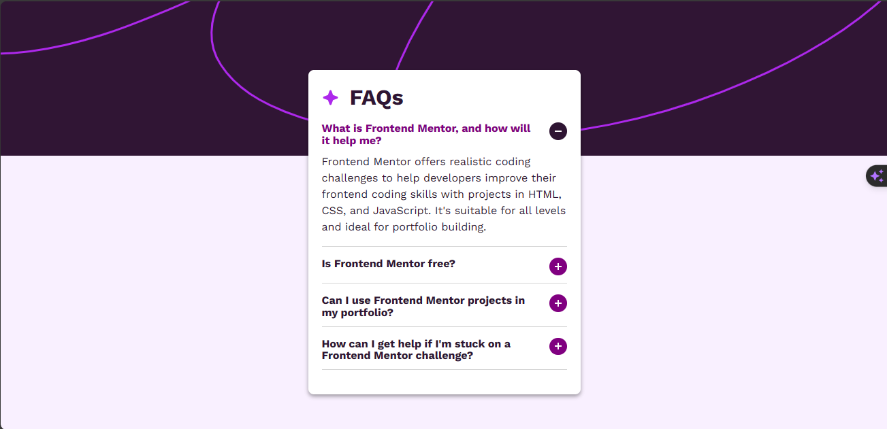

# Frontend Mentor - FAQ accordion solution

This is a solution to the [FAQ accordion challenge on Frontend Mentor](https://www.frontendmentor.io/challenges/faq-accordion-wyfFdeBwBz). 

## Table of contents

- [Overview](#overview)
  - [Screenshot](#screenshot)
  - [Links](#links)
  - [Built with](#built-with)
- [Author](#author)

## Overview

### Screenshot

### Links

- Solution URL: [Frontend mentor solution](https://www.frontendmentor.io/solutions/faq-accordion-3AfvgQVwBN)
- Live Site URL: [Live site url.](https://faq-accordion-component360.netlify.app/)
- Source code: [Github Repo](https://github.com/tamimulislam360/faq-accordion-component)

### Built with

- Semantic HTML5 markup
- CSS custom properties
- Flexbox
- CSS Grid
- JavaScript
- Mobile-first workflow

## Author

- Website - [Tamimul Islam](https://www.tamimul-islam.vercel.app)
- Frontend Mentor - [@tamimulislam360](https://www.frontendmentor.io/profile/tamimulislam360)
- Twitter - [@tamimulislam360](https://www.twitter.com/tamimulislam360)
